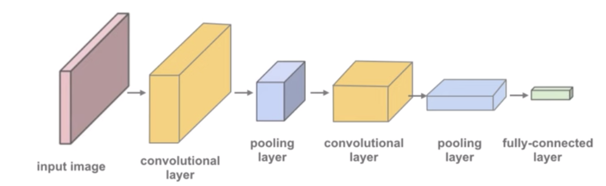
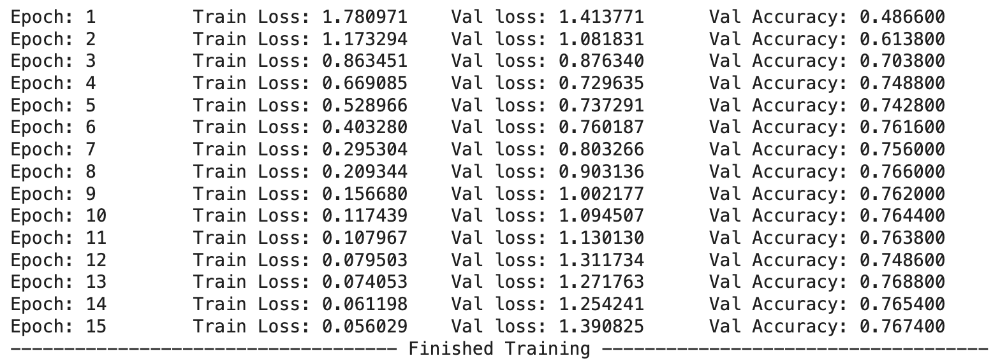
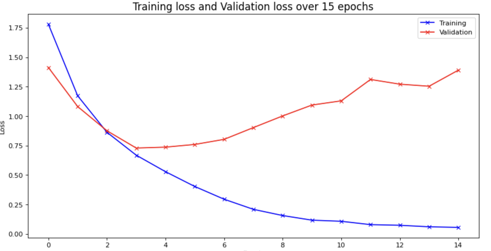

# UROP-CNN

## Introduction

This is a repository for the UROP project on CNN. The project is to build a CNN model to classify the images of CIFAR-10 dataset. The model is built using pytorch.

## Model architecture

The model architecture is shown below:

1. **Convolutional Layers (First Block):**
   - Input: 3 channels (for RGB images).
   - First convolutional layer: 3 input channels, 32 output channels, 3x3 kernel, padding of 1.
   - ReLU activation function.
   - Second convolutional layer: 32 input channels, 64 output channels, 3x3 kernel, stride of 1, padding of 1.
   - ReLU activation function.
   - Max pooling layer with a 2x2 kernel and stride of 2, reducing spatial dimensions by half.
   - Output size after this block: 64 channels, 16x16 spatial dimensions.

2. **Convolutional Layers (Second Block):**
   - Third convolutional layer: 64 input channels, 128 output channels, 3x3 kernel, stride of 1, padding of 1.
   - ReLU activation function.
   - Fourth convolutional layer: 128 input channels, 128 output channels, 3x3 kernel, stride of 1, padding of 1.
   - ReLU activation function.
   - Max pooling layer with a 2x2 kernel and stride of 2, reducing spatial dimensions by half.
   - Output size after this block: 128 channels, 8x8 spatial dimensions.

3. **Convolutional Layers (Third Block):**
   - Fifth convolutional layer: 128 input channels, 256 output channels, 3x3 kernel, stride of 1, padding of 1.
   - ReLU activation function.
   - Sixth convolutional layer: 256 input channels, 256 output channels, 3x3 kernel, stride of 1, padding of 1.
   - ReLU activation function.
   - Max pooling layer with a 2x2 kernel and stride of 2, reducing spatial dimensions by half.
   - Output size after this block: 256 channels, 4x4 spatial dimensions.

4. **Fully Connected Layers:**
   - `nn.Flatten()` is used to flatten the spatial dimensions into a 1D tensor.
   - `nn.Dropout()` is used to dropout some paramters to reduce the overfitting effect
   - First fully connected layer: 256*4*4 input features, 1024 output features.
   - ReLU activation function.
   - `nn.Dropout()` is used to dropout some paramters to reduce the overfitting effect
   - Second fully connected layer: 1024 input features, 512 output features.
   - ReLU activation function.
   - `nn.Dropout()` is used to dropout some paramters to reduce the overfitting effect
   - Third fully connected layer: 512 input features, 10 output features (for classification into 10 classes).

## Reviewing training results on google colab

## Training results

Using the model architecture above, the model is trained for 15 epochs with a batch size of 128. This model only achieves an accuracy of 0.75 on the test set. The training results are shown below:

It is easy to see that the model is overfitting the training set. The training loss is decreasing while the validation loss is increasing. The training accuracy is increasing while the validation accuracy is decreasing. This is a clear sign of overfitting.

